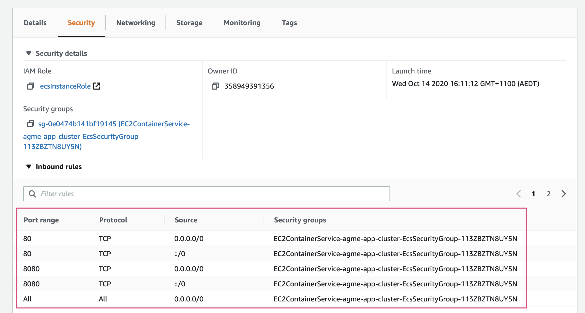

# RMIT SEPT 2020 Major Project

# Group 5

## Members
* U'REN, Donald (s3686963)
* LEE, Ge (s3776409)
* KHOSRAVI, Ali (s3788120)

## Records

* Code repository: [Github](https://github.com/RMIT-SEPT/majorproject-2-thurs-18-30-5) 
* Task management: [ClickUp](https://app.clickup.com/6916505/v/l/s/6940247)
* Communications channel: [Microsoft Teams](https://teams.microsoft.com/l/channel/19%3a4b6e5f8a1553417dbeff5f23690d8ebc%40thread.tacv2/General?groupId=25ef5859-063c-4c1a-8d46-988c0c7cb83d&tenantId=d1323671-cdbe-4417-b4d4-bdb24b51316b)

## Code documentation

[Quick Start](/docs/README.md) in `docs` folder

## Project documentation
[Wiki](https://github.com/RMIT-SEPT/majorproject-2-thurs-18-30-5/wiki) via `Wiki` tab

## Instructions

### Frontend
#### Build
`npm run test` if testing the frontend project
  or 
`docker build .` to test the dockerised backend project

#### Deploy
In order to enable CICD, the project will need to be setup with CircleCI:
- initalise project with CircleCI

In order to deploy the frontend AWS resources will need to be configured ([Guide](https://www.bogotobogo.com/DevOps/DevOps-ECS-ECR.php)):
- creata a new ECR for the frontend project
- create a task definition
- create a new ECS Cluster for deployment of frontend containers
- create a new ECS Service to update EC2 instances

For the frontend EC2 instance, ensure that the inbound security group rules allow for access from all addresses as follows:

After these have been created, environment variables will needed to be added to the CircleCI project
- AWS Access Key ID
- AWS Secret Access Key
- AWS Session Token

Once a developer commits or merges into master, the new container will be pushed to AWS and deployed to the EC2 instance.

#### Run
To run the dockerised frontend web app locally, you can run `docker run -it --rm -p 1337:8080 agme-app`

In order to access the deployed instance, simply navigate to the EC2 Instance panel and access the frontend via the IPv4 link

### Backend
#### Build
`mvn package` if testing the backend project
  or 
`docker build .` to test the dockerised backend project

#### Deploy
In order to enable CICD, the project will need to be setup with CircleCI:
- initalise project with CircleCI

In order to deploy the backend AWS resources will need to be configured:
- create a new RDS instance for the project
  - for our project, given budget constraints, we used a free-tier MySQL RDS instance
  - take note of the endpoint and port number, updating application.properties and any references
  
- create a new ECR for the backend project, as per course guides
- create a new ECS Cluster for deployment of backend containers: [Guide](https://aws.amazon.com/premiumsupport/knowledge-center/ecs-tasks-pull-images-ecr-repository/)
- create a new ECS service to update EC2 instances: LINK TO TUTORIAL

For the RDS Instance, ensure that the inbound security group rules allow for access from all addresses as follows:

For the backend EC2 instance, ensure that the inbound security group rules allow for access from all addresses as follows:

After these have been created, environment variables will needed to be added to the CircleCI project
- AWS Access Key ID
- AWS Account ID
- AWS Default Region
- AWS Resource Name Prefix: this is the name of the ECR instance
- AWS Secret Access Key
- AWS Session Token

Once a developer commits or merges into master, the new container will be pushed to AWS and deployed to the EC2 instance.

#### Run
To run the dockerised backend service locally, you can run `docker run -p 8080:8080 -t container`

In order to access the deployed instance, simply navigate to the EC2 Instance panel and access the backend via the IPv4 link

